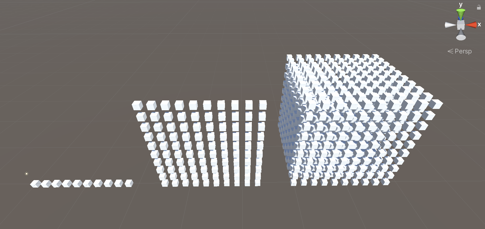

# dig250-unity-performance

A sample Unity project to illustrate performance concepts.

> NOTE: Unity Profiler does not run (well, at all as of 2022 April 5) on Apple Silicon (M1) computers.

## Instantiation Overload

- Instantiate a lot of objects

